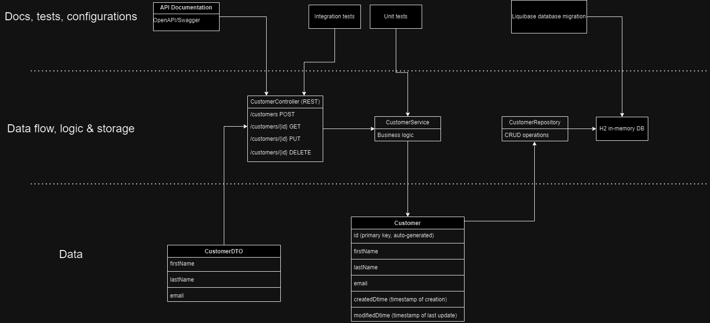

# Turtleman
Turtleman is a customer management service.
The project name is not a reference to the slowness of the turtle but rather draws its inspiration from the protective shell of its namesake.
Turtleman protects your customer data like a turtle's protective shell.
It will start the journey with your customer data and cross the finish line with your customer data safe and secure!

# How to run Turtleman
`application.properties` is home to some important settings that you might want to change, such as the server.port (defaults to 8080).

`./gradlew build` to build the project and execute tests

`./gradlew test` to run tests. Check `build\reports\tests\test\index.html` for visual feedback

`./gradlew bootRun` runs the project, including the API

# Access to API & documentation
`localhost:8080/turtledoc` or `localhost:8080/swagger-ui/index.html` for API documentation

`localhost:8080/db-dev` for H2 database management

`localhost:8080/api/` is the API endpoint. See Swagger documentation for more

As it stands, none of the endpoints are password protected or otherwise concealed. The turtle stands proud!

# Technologies and design
Turtleman uses Java 17 alongside Spring for that modern touch of enterprise code. 

The H2 in-memory database keeps the data access lightning fast. Just don't turn off the server!

If you do need to start or restart the server, Liquibase provides schema migrations so that everything will be up and running without additional tinkering.

Read up on our RESTful service in the attached Swagger documentation.

Design chart:

# The future
Unfortunately today TurtleMan has no frontend to turn to. When that time comes, the frontend should be called HareMan.

Also, fix logging, database persistence, data sanitization, authorization and the horrible sense of naming projects.